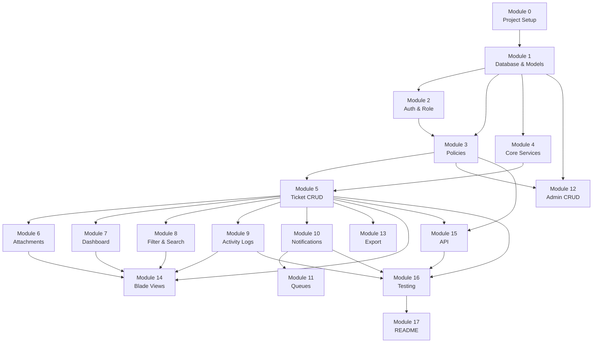
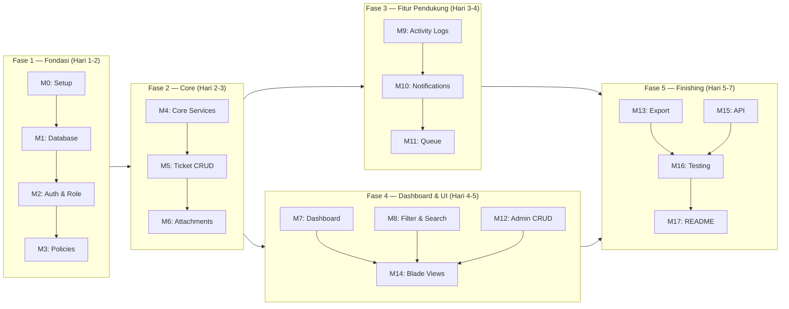

# Plan - Ticket Support System
> Laravel Intermediate Level | Frontend: Blade | No Bonus

---

## Peta Ketergantungan Antar Modul



---

## Jalur Pengerjaan Per Fase



---

## ERD

```mermaid
erDiagram
    users {
        bigint id PK
        string name
        string email
        bigint role_id FK
        bigint team_id FK
    }
    roles {
        bigint id PK
        string name
        string slug
    }
    teams { bigint id PK; string name }
    tickets {
        bigint id PK
        string ticket_number
        string title
        text description
        enum status
        bigint priority_id FK
        bigint category_id FK
        bigint created_by FK
        bigint assigned_agent_id FK
        timestamp due_at
        timestamp resolved_at
        timestamp closed_at
    }
    categories { bigint id PK; string name }
    priorities { bigint id PK; string name; int level }
    labels { bigint id PK; string name; string color }
    sla_rules { bigint id PK; bigint priority_id FK; int response_hours; int resolution_hours }
    comments { bigint id PK; bigint ticket_id FK; bigint user_id FK; text body; boolean is_internal }
    attachments {
        bigint id PK
        string attachable_type
        bigint attachable_id
        bigint uploaded_by FK
        string original_name
        string stored_name
        string path
        string mime_type
        int size
    }
    activity_logs { bigint id PK; bigint ticket_id FK; bigint user_id FK; string action; text old_value; text new_value }
    ticket_label { bigint ticket_id FK; bigint label_id FK }

    users }o--|| roles : "has one"
    users ||--o{ tickets : "creates"
    users ||--o{ tickets : "assigned to"
    users }o--o{ teams : "belongs to"
    tickets }o--|| categories : "has"
    tickets }o--|| priorities : "has"
    tickets }o--o{ labels : "tagged with"
    tickets ||--o{ comments : "has"
    tickets ||--o{ activity_logs : "tracked in"
    priorities ||--|| sla_rules : "has"
    comments ||--o{ attachments : "has"
    tickets ||--o{ attachments : "has"
```

---

## Module 0 — Project Setup

```bash
composer create-project laravel/laravel ticket-system
composer require laravel/breeze --dev
php artisan breeze:install blade
npm install && npm run build
php artisan queue:table
php artisan notifications:table
php artisan storage:link
```

| File | Perubahan |
|---|---|
| `.env` | `QUEUE_CONNECTION=database`, mail config ke Mailpit |
| `config/filesystems.php` | Default disk tetap `local`, tapi link ke `public` untuk attachments |

---

## Module 1 — Database & Models

### Migrations

| File | Catatan Implementasi |
|---|---|
| `database/migrations/..._create_roles_table.php` | Kolom: `id`, `name` (display name), `slug` (lowercase, dipakai untuk cek role di kode: `admin`, `supervisor`, `agent`, `customer`), `timestamps` |
| `database/migrations/..._add_role_id_to_users_table.php` | Tambah kolom `role_id` (FK ke `roles`, nullable dulu saat migration, lalu isi via seeder, baru ubah jadi not null jika perlu). Jangan buat pivot — satu user satu role. |
| `database/migrations/..._create_teams_table.php` | Simpel: `id`, `name`, `timestamps` |
| `database/migrations/..._create_team_user_table.php` | Pivot, tidak perlu timestamps |
| `database/migrations/..._create_categories_table.php` | Tambah `deleted_at` untuk soft delete |
| `database/migrations/..._create_labels_table.php` | Tambah kolom `color` (hex string), `deleted_at` |
| `database/migrations/..._create_priorities_table.php` | Tambah kolom `level` (int) untuk urutan sorting, `deleted_at` |
| `database/migrations/..._create_sla_rules_table.php` | FK ke `priorities`, tidak perlu soft delete |
| `database/migrations/..._create_tickets_table.php` | Kolom `status` pakai string bukan enum DB supaya fleksibel. Validasi di app layer. |
| `database/migrations/..._create_ticket_label_table.php` | Pivot biasa |
| `database/migrations/..._create_comments_table.php` | Kolom `is_internal` boolean default `false` |
| `database/migrations/..._create_attachments_table.php` | `attachable_type` + `attachable_id` untuk polymorphic |
| `database/migrations/..._create_activity_logs_table.php` | `old_value` dan `new_value` pakai tipe `text`, nullable |

**Index yang wajib ditambahkan di migration `tickets`:**
```php
$table->index('status');
$table->index('created_by');
$table->index('assigned_agent_id');
$table->index('due_at');
$table->index(['priority_id', 'category_id']); // composite untuk filter dashboard
```

### Models

| File | Catatan Implementasi |
|---|---|
| `app/Models/User.php` | Tambah relasi `role(): BelongsTo`. Tambah helper method `hasRole(string $slug): bool` — cek via `$this->role->slug === $slug`. Tambah `isCustomer()`, `isAgent()`, `isSupervisor()`, `isAdmin()` sebagai shortcut. Dua relasi ticket tetap sama: `createdTickets()` dan `assignedTickets()`. |
| `app/Models/Role.php` | **Buat baru.** `hasMany User`. Kolom `slug` dipakai sebagai identifier di kode, bukan `id`. |
| `app/Models/Ticket.php` | Cast `status` ke `TicketStatus` enum. Tambah scope `overdue()` dan `unassigned()` di sini. |
| `app/Models/Comment.php` | Tambah scope `public()` dan `internal()` supaya query di view lebih bersih |
| `app/Models/Attachment.php` | Tambah accessor `url` yang return `Storage::url($this->path)` |
| `app/Models/Priority.php` | Tambah scope `ordered()` sort by `level` ascending |

### Enums

| File | Catatan |
|---|---|
| `app/Enums/TicketStatus.php` | Pakai PHP 8.1 backed enum (`string`). Tambah method `label()` untuk display name. |

`UserRole` enum **tidak dibuat** — role sekarang hidup di tabel `roles`. Pengecekan role dilakukan via `$user->hasRole('admin')`, bukan via enum.

### Factories & Seeders

| File | Catatan Implementasi |
|---|---|
| `database/factories/TicketFactory.php` | State method: `->unassigned()`, `->overdue()`, `->forCustomer(User $u)` supaya mudah dipakai di test |
| `database/factories/CommentFactory.php` | State method: `->internal()` untuk generate internal note |
| `database/seeders/DatabaseSeeder.php` | Urutan call: **Role** → User → Team → Category → Label → Priority → SlaRule → Ticket |
| `database/seeders/RoleSeeder.php` | **Buat baru.** Seed 4 role: `{name: 'Administrator', slug: 'admin'}`, `{name: 'Supervisor', slug: 'supervisor'}`, `{name: 'Agent', slug: 'agent'}`, `{name: 'Customer', slug: 'customer'}` |
| `database/seeders/UserSeeder.php` | Setelah create user, set `role_id` langsung: `$user->role_id = Role::where('slug', 'admin')->value('id')` lalu `$user->save()` |

---

## Module 2 — Authentication & Role

| File | Catatan Implementasi |
|---|---|
| `app/Http/Controllers/Auth/RegisteredUserController.php` | Di method `store()`, sebelum `$user->save()`, tambahkan: `$user->role_id = Role::where('slug', 'customer')->value('id')`. Pakai `value('id')` supaya tidak load full model. |
| `app/Http/Middleware/EnsureRole.php` | Middleware menerima multiple role via `handle($request, $next, ...$roles)`. Cek `in_array($request->user()->role->slug, $roles)`. Kalau gagal, redirect dengan pesan "Unauthorized". |
| `bootstrap/app.php` | Daftarkan dengan alias `role`: `->withMiddleware(fn($m) => $m->alias(['role' => EnsureRole::class]))` |

---

## Module 3 — Authorization (Policies)

Semua policy didaftarkan di `app/Providers/AppServiceProvider.php` via `Gate::policy()`.

> Semua pengecekan role di policy menggunakan `$user->hasRole('slug')`, bukan perbandingan enum. Ini supaya konsisten dengan arsitektur role dari tabel.

### `app/Policies/TicketPolicy.php`

| Method | Admin | Supervisor | Agent | Customer |
|---|---|---|---|---|
| `viewAny` | Semua ticket | Hanya ticket milik agent di timnya | Hanya ticket yang di-assign ke dia | Hanya ticket yang dia buat |
| `view` | Selalu boleh | Boleh jika ticket milik agent di timnya | Boleh jika ticket di-assign ke dia | Boleh jika dia yang buat |
| `create` | Boleh | Boleh | Tidak boleh | Boleh |
| `update` | Boleh update field apapun | Boleh update field non-sensitif di ticket timnya | Tidak boleh update field ticket | Tidak boleh (setelah submit) |
| `assign` | Boleh assign ke siapapun | Boleh assign ke agent di timnya saja | Tidak boleh | Tidak boleh |
| `delete` | Tidak diimplementasi (return false) | Tidak boleh | Tidak boleh | Tidak boleh |

**Catatan untuk `viewAny` supervisor:** ambil semua `id` agent yang `team_id`-nya sama dengan supervisor, lalu filter ticket dengan `whereIn('assigned_agent_id', $agentIds)`. Contoh:
```php
$agentIds = User::where('team_id', $user->team_id)
    ->whereHas('role', fn($q) => $q->where('slug', 'agent'))
    ->pluck('id');

return $query->whereIn('assigned_agent_id', $agentIds);
```

### `app/Policies/CommentPolicy.php`

| Method | Logika |
|---|---|
| `create` | Boleh jika user bisa `view` ticket terkait (delegasi ke TicketPolicy) |
| `viewInternal` | Return `true` hanya jika `$user->hasRole('agent')` atau `hasRole('supervisor')` atau `hasRole('admin')`. Customer selalu `false`. |

### `app/Policies/AttachmentPolicy.php`

| Method | Logika |
|---|---|
| `view` | Ambil parent (ticket atau comment), lalu cek apakah user boleh `view` parent tersebut via TicketPolicy |
| `create` | Sama seperti `view` — bisa akses parent = bisa upload |
| `delete` | Hanya uploader atau `$user->hasRole('admin')` |

### `app/Policies/CategoryPolicy.php`, `LabelPolicy.php`, `PriorityPolicy.php`, `SlaRulePolicy.php`, `RolePolicy.php`

Semua method (viewAny, create, update, delete) hanya boleh admin. Implementasinya cukup `return $user->hasRole('admin')`.

### `app/Policies/UserPolicy.php`

| Method | Logika |
|---|---|
| `viewAny` | Hanya `$user->hasRole('admin')` |
| `create` | Hanya admin |
| `update` | Admin boleh update siapapun. User boleh update dirinya sendiri (untuk profile). |
| `delete` | Hanya admin, dan tidak boleh hapus dirinya sendiri (`$user->id !== $target->id`) |

---

## Module 4 — Core Services

### `app/Services/TicketNumberService.php`

```
generate(): string
  1. Ambil tahun sekarang
  2. Query MAX(ticket_number) WHERE ticket_number LIKE 'TCK-{year}-%'
  3. Parse angka urut dari hasil query, increment +1
  4. Pad kiri dengan nol sampai 6 digit
  5. Return "TCK-{year}-{padded}"

Catatan: wrap dalam DB::transaction() supaya tidak ada race condition jika dua user submit ticket bersamaan.
```

### `app/Services/TicketStatusService.php`

```php
// Definisikan di dalam class sebagai private const
private const TRANSITION_MAP = [
    'open'                 => ['assigned', 'closed'],
    'assigned'             => ['in_progress', 'escalated'],
    'in_progress'          => ['waiting_for_customer', 'resolved', 'escalated'],
    'waiting_for_customer' => ['in_progress', 'resolved'],
    'resolved'             => ['closed', 'reopened'],
    'closed'               => ['reopened'],
    'reopened'             => ['assigned', 'in_progress'],
    'escalated'            => ['in_progress', 'resolved'],
];

isValidTransition(string $from, string $to): bool
allowedNextStatuses(string $current): array
```

`UpdateTicketStatusRequest` wajib memanggil `isValidTransition()` di dalam rules atau di `withValidator()`.

### `app/Services/SlaService.php`

```
calculateDueDate(Priority $priority): Carbon
  1. Load SlaRule berdasarkan priority
  2. Return now()->addHours($rule->resolution_hours)

Catatan: jika SlaRule tidak ditemukan untuk priority tersebut, throw Exception supaya
developer tahu ada data yang kurang, bukan diam-diam return null.
```

### `app/Services/OverdueService.php`

```
isOverdue(Ticket $ticket): bool
  Return true jika:
  - $ticket->due_at !== null
  - $ticket->due_at < now()
  - status BUKAN 'resolved' atau 'closed'
```

### `app/Services/ActivityLogService.php`

```
log(Ticket $ticket, User $user, string $action, mixed $old = null, mixed $new = null): void
  - Simpan ke tabel activity_logs
  - $old dan $new diconvert ke string jika bukan string (misal pakai json_encode)
  - Tidak boleh throw exception — log gagal tidak boleh block main flow. Wrap dalam try-catch.
```

---

## Module 5 — Ticket CRUD

### Form Requests

| File | Catatan Implementasi |
|---|---|
| `app/Http/Requests/Ticket/StoreTicketRequest.php` | `authorize()` pakai `Gate::allows('create', Ticket::class)`. Tidak perlu hardcode role di sini. |
| `app/Http/Requests/Ticket/UpdateTicketRequest.php` | Di method `rules()`, cek `auth()->user()->role`. Jika bukan admin/supervisor, hapus key `assigned_agent_id` dari rules supaya field itu diabaikan walau dikirim. |
| `app/Http/Requests/Ticket/UpdateTicketStatusRequest.php` | Tambahkan validasi custom di `withValidator()`: panggil `TicketStatusService::isValidTransition($ticket->status, $request->status)`. Jika false, tambahkan error. |
| `app/Http/Requests/Ticket/AssignTicketRequest.php` | Validasi bahwa `assigned_agent_id` adalah user yang exist dan role-nya = agent. |
| `app/Http/Requests/Comment/StoreCommentRequest.php` | Jika `is_internal = true`, cek di `authorize()` bahwa user bukan customer. |

### Controllers

| File | Catatan Implementasi |
|---|---|
| `app/Http/Controllers/TicketController.php` | Method `index()` scope query berdasarkan role. Jangan pakai if-else di controller — delegasi ke method private `scopeByRole(Builder $q): Builder` atau ke `TicketQueryFilter`. |
| `app/Http/Controllers/TicketController.php` | Method `store()` panggil `TicketNumberService::generate()` dan `SlaService::calculateDueDate()`, lalu `ActivityLogService::log()`, lalu dispatch `TicketCreatedNotification`. |
| `app/Http/Controllers/TicketStatusController.php` | Single responsibility: hanya handle update status. Panggil `ActivityLogService::log()` dengan old dan new status. |
| `app/Http/Controllers/TicketAssignController.php` | Single responsibility: hanya handle assign agent. Dispatch `TicketAssignedNotification` setelah save. |
| `app/Http/Controllers/CommentController.php` | Setelah simpan, dispatch `TicketCommentedNotification` ke semua user terkait ticket (creator + assigned agent). Exclude pengirim komentar dari notifikasi. |
| `app/Http/Controllers/AttachmentController.php` | Method `show()` wajib cek policy sebelum serve file. Jangan langsung return URL publik. |

### Routes

| File | Catatan |
|---|---|
| `routes/web.php` | Grouping berdasarkan role, bukan berdasarkan resource. Lebih mudah di-maintain dan dibaca. |
| `routes/api.php` | Prefix `v1`, semua route dalam `auth:sanctum` middleware kecuali login. |

```php
// routes/web.php
Route::middleware('auth')->group(function () {

    // Semua role yang sudah login
    Route::resource('tickets', TicketController::class)->only(['index', 'create', 'store', 'show']);
    Route::post('tickets/{ticket}/comments', [CommentController::class, 'store'])->name('tickets.comments.store');
    Route::post('tickets/{ticket}/attachments', [AttachmentController::class, 'store'])->name('tickets.attachments.store');
    Route::get('attachments/{attachment}', [AttachmentController::class, 'show'])->name('attachments.show');

    // Agent, Supervisor, Admin
    Route::middleware('role:agent,supervisor,admin')->group(function () {
        Route::patch('tickets/{ticket}/status', [TicketStatusController::class, 'update'])->name('tickets.status.update');
    });

    // Supervisor, Admin only
    Route::middleware('role:supervisor,admin')->group(function () {
        Route::patch('tickets/{ticket}/assign', [TicketAssignController::class, 'update'])->name('tickets.assign');
        Route::get('tickets/export', [ExportController::class, 'tickets'])->name('tickets.export');
    });

    // Admin only
    Route::middleware('role:admin')->prefix('admin')->name('admin.')->group(function () {
        Route::resource('roles', Admin\RoleController::class);
        Route::resource('users', Admin\UserController::class);
        Route::resource('categories', Admin\CategoryController::class);
        Route::resource('labels', Admin\LabelController::class);
        Route::resource('priorities', Admin\PriorityController::class);
        Route::resource('sla-rules', Admin\SlaRuleController::class);
        Route::get('logs', Admin\ActivityLogController::class)->name('logs');
    });

    // Dashboard (redirect berdasarkan role)
    Route::get('dashboard', DashboardController::class)->name('dashboard');
    Route::get('dashboard/admin', Dashboard\AdminDashboardController::class)->name('dashboard.admin');
    Route::get('dashboard/supervisor', Dashboard\SupervisorDashboardController::class)->name('dashboard.supervisor');
    Route::get('dashboard/agent', Dashboard\AgentDashboardController::class)->name('dashboard.agent');
    Route::get('dashboard/customer', Dashboard\CustomerDashboardController::class)->name('dashboard.customer');
});
```

---

## Module 6 — Attachments

| File | Catatan Implementasi |
|---|---|
| `app/Http/Controllers/AttachmentController.php` | `show()`: resolve path dari DB, bukan dari URL. Gunakan `response()->file(storage_path('app/public/' . $attachment->path))` setelah cek policy. |
| `app/Http/Controllers/AttachmentController.php` | `store()`: generate `stored_name` pakai `Str::uuid() . '.' . $ext` supaya tidak bisa ditebak. Simpan ke subfolder `attachments/{ticket_id}/`. |

**Yang sering salah:** jangan simpan path absolut di DB, simpan path relatif dari disk root. Contoh: `attachments/123/uuid.pdf`, bukan `/var/www/storage/app/public/attachments/...`.

---

## Module 7 — Dashboard

### File Controllers

| File | Query Utama |
|---|---|
| `app/Http/Controllers/Dashboard/AdminDashboardController.php` | `Ticket::groupBy('status')->count()`, `Ticket::where('due_at', '<', now())->whereNotIn('status', ['resolved','closed'])->count()`, subquery top 5 agents |
| `app/Http/Controllers/Dashboard/SupervisorDashboardController.php` | Scope semua query dengan `whereIn('assigned_agent_id', $supervisor->team->agents->pluck('id'))` |
| `app/Http/Controllers/Dashboard/AgentDashboardController.php` | Scope semua query dengan `where('assigned_agent_id', auth()->id())` |
| `app/Http/Controllers/Dashboard/CustomerDashboardController.php` | Scope semua query dengan `where('created_by', auth()->id())` |
| `app/Http/Controllers/DashboardController.php` | Hanya berisi redirect berdasarkan role, tidak ada query sama sekali |

**Penting:** semua data dashboard harus dari query nyata, bukan hardcode. Dashboard kosong lebih baik dari data palsu.

### File Views

| File | Konten |
|---|---|
| `resources/views/dashboard/admin.blade.php` | Cards: total, per status, per priority, overdue, unassigned, avg resolution, top 5 agents |
| `resources/views/dashboard/supervisor.blade.php` | Cards: tim tickets, open, overdue, escalated, agent workload |
| `resources/views/dashboard/agent.blade.php` | Cards: assigned, overdue, by status, recently updated |
| `resources/views/dashboard/customer.blade.php` | Cards: my tickets, open, resolved, recently updated |

---

## Module 8 — Filtering, Searching, Sorting, Pagination

### File

| File | Catatan Implementasi |
|---|---|
| `app/Filters/TicketQueryFilter.php` | Terima `Builder` dan `Request`. Setiap filter adalah method terpisah, dipanggil secara conditional jika parameter ada di request. |
| `app/Http/Controllers/TicketController.php` | Di `index()`, buat base query dulu (scope by role), baru pass ke `TicketQueryFilter::apply($query, $request)`. |

```php
// Struktur TicketQueryFilter
class TicketQueryFilter
{
    public function apply(Builder $query, Request $request): Builder
    {
        return $query
            ->when($request->status,            fn($q) => $this->filterByStatus($q, $request->status))
            ->when($request->priority_id,       fn($q) => $this->filterByPriority($q, $request->priority_id))
            ->when($request->category_id,       fn($q) => $this->filterByCategory($q, $request->category_id))
            ->when($request->label_id,          fn($q) => $this->filterByLabel($q, $request->label_id))
            ->when($request->assigned_agent_id, fn($q) => $this->filterByAgent($q, $request->assigned_agent_id))
            ->when($request->date_from,         fn($q) => $this->filterByDateRange($q, $request->date_from, $request->date_to))
            ->when($request->overdue,           fn($q) => $this->filterOverdue($q))
            ->when($request->search,            fn($q) => $this->search($q, $request->search));
    }
    // ... method-method filter
}
```

**Catatan sorting:** sort direction wajib divalidasi. Hanya terima `asc` atau `desc`, jangan langsung masukkan ke query dari request.

---

## Module 9 — Activity Logs

| File | Catatan Implementasi |
|---|---|
| `app/Services/ActivityLogService.php` | Dipanggil dari controller setelah operasi berhasil. Jangan panggil sebelum save, karena kalau save gagal, log sudah terlanjur masuk. |
| `app/Http/Controllers/Admin/ActivityLogController.php` | Ini invokable controller (`__invoke`), karena hanya punya satu action: tampilkan list log. |
| `resources/views/admin/logs/index.blade.php` | Tabel log dengan filter minimal: `ticket_id`, `user_id`, `action`, date range. |

**Catatan untuk customer view:** customer hanya boleh lihat log ticket miliknya, dan field yang ditampilkan hanya `action` dan `created_at` — bukan `old_value`/`new_value` karena bisa berisi data internal.

---

## Module 10 — Notifications

### File Notifications

| File | Catatan Implementasi |
|---|---|
| `app/Notifications/TicketCreatedNotification.php` | Constructor terima `Ticket $ticket`. Di method `toMail()`, include link ke ticket detail. |
| `app/Notifications/TicketAssignedNotification.php` | Implements `ShouldQueue`. Constructor terima `Ticket $ticket`. Dikirim ke `$ticket->assignedAgent`. |
| `app/Notifications/TicketCommentedNotification.php` | Implements `ShouldQueue`. Constructor terima `Ticket $ticket` dan `Comment $comment`. Kirim ke creator + assigned agent, kecuali si pengirim komentar. |
| `app/Notifications/TicketResolvedNotification.php` | Dikirim ke `$ticket->creator`. |
| `app/Notifications/TicketEscalatedNotification.php` | Kirim ke semua user dengan role supervisor dan admin via `User::whereIn('role', ['supervisor', 'admin'])->get()`. |
| `app/Notifications/SlaOverdueNotification.php` | Sama seperti escalated — kirim ke supervisor dan admin. Dipanggil dari `CheckOverdueTicketsCommand`. |

Semua notification pakai channel `['mail', 'database']`. Channel `database` dipakai untuk notification bell di topbar.

### File Views Email

| File | Isi |
|---|---|
| `resources/views/emails/ticket-created.blade.php` | Ticket number, title, priority, link ke ticket |
| `resources/views/emails/ticket-assigned.blade.php` | Ticket number, title, customer name, due date, link ke ticket |
| `resources/views/emails/ticket-resolved.blade.php` | Ticket number, title, resolved at, link ke ticket |

---

## Module 11 — Queues & Jobs

| File | Catatan Implementasi |
|---|---|
| `app/Console/Commands/CheckOverdueTicketsCommand.php` | Query ticket yang `due_at < now()` dan status bukan resolved/closed dan belum pernah dikirim notifikasi overdue (tambahkan kolom `overdue_notified_at` di tabel tickets atau cek via activity_log). Dispatch `SlaOverdueNotification`. |
| `routes/console.php` | `Schedule::command('tickets:check-overdue')->hourly()` |

**Mencegah notifikasi overdue ganda:** tambahkan kolom `overdue_notified_at` (nullable timestamp) di tabel `tickets`. Command hanya kirim notifikasi jika kolom ini masih null, lalu set setelah kirim.

---

## Module 12 — Admin CRUD Modules

### File Controllers

| File | Catatan Implementasi |
|---|---|
| `app/Http/Controllers/Admin/RoleController.php` | **Buat baru.** CRUD role. Saat delete, cek apakah masih ada user yang `role_id = $role->id`. Jika ada, tolak delete. Slug tidak boleh diedit setelah dibuat karena dipakai di kode (`hasRole('slug')`). |
| `app/Http/Controllers/Admin/UserController.php` | Saat create/edit user, tampilkan dropdown semua role dari tabel `roles`. Saat delete, cek apakah user punya ticket. Jika ada, tolak delete. |
| `app/Http/Controllers/Admin/CategoryController.php` | Gunakan `SoftDeletes`. Saat delete, cek apakah ada ticket yang pakai kategori ini. |
| `app/Http/Controllers/Admin/SlaRuleController.php` | Satu SLA rule per priority. Saat create, validasi tidak boleh duplicate priority. |

### File Form Requests

| File | Catatan |
|---|---|
| `app/Http/Requests/User/StoreUserRequest.php` | Validasi `email` unique, `role_id` harus `exists:roles,id` |
| `app/Http/Requests/User/UpdateUserRequest.php` | `email` unique ignore self: `Rule::unique('users')->ignore($this->user)`. `role_id` tetap `exists:roles,id`. |
| `app/Http/Requests/Role/StoreRoleRequest.php` | **Buat baru.** Validasi `name` required, `slug` unique di tabel `roles` dan hanya boleh lowercase + underscore/dash. Saat update, `slug` tidak boleh diubah — lock field slug di form edit. |
| `app/Http/Requests/SlaRule/StoreSlaRuleRequest.php` | Validasi `priority_id` unique di tabel `sla_rules` (kecuali saat update) |

### File Views Admin

```
resources/views/admin/
├── roles/
│   ├── index.blade.php     ← tabel + jumlah user per role
│   ├── create.blade.php    ← form: name, slug (readonly setelah submit)
│   └── edit.blade.php      ← form: name only (slug dikunci, tampil sebagai text biasa)
├── users/
│   ├── index.blade.php     ← tabel + search by name/email + pagination
│   ├── create.blade.php    ← form: name, email, password, role (dropdown dari tabel roles)
│   └── edit.blade.php      ← form: name, email, role (password optional)
├── categories/
│   ├── index.blade.php
│   ├── create.blade.php
│   └── edit.blade.php
├── labels/
│   ├── index.blade.php
│   ├── create.blade.php    ← form: name, color picker
│   └── edit.blade.php
├── priorities/
│   ├── index.blade.php
│   ├── create.blade.php    ← form: name, level (int)
│   └── edit.blade.php
├── sla-rules/
│   ├── index.blade.php
│   ├── create.blade.php    ← form: priority (dropdown), response_hours, resolution_hours
│   └── edit.blade.php
└── logs/
    └── index.blade.php
```

---

## Module 13 — Export

| File | Catatan Implementasi |
|---|---|
| `app/Http/Controllers/ExportController.php` | Gunakan `response()->streamDownload()` supaya tidak perlu simpan file dulu ke disk. |
| `app/Exports/TicketExport.php` | Terima filter dari request, build query, loop hasil, tulis via `fputcsv`. Header CSV: ticket_number, title, status, priority, category, customer, agent, created_at, due_at, resolved_at. |

---

## Module 14 — Blade Views

### Struktur Folder Views

```
resources/views/
├── layouts/
│   ├── app.blade.php                         ← layout utama
│   └── guest.blade.php                       ← dari Breeze
│
├── components/
│   ├── status-badge.blade.php
│   ├── priority-badge.blade.php
│   ├── confirm-modal.blade.php               ← Alpine.js atau dialog HTML biasa
│   ├── empty-state.blade.php                 ← terima prop: title, message
│   ├── flash-message.blade.php
│   ├── pagination.blade.php
│   └── sidebar/
│       ├── admin.blade.php
│       ├── supervisor.blade.php
│       ├── agent.blade.php
│       └── customer.blade.php
│
├── auth/                                     ← dari Breeze
│
├── dashboard/
│   ├── admin.blade.php
│   ├── supervisor.blade.php
│   ├── agent.blade.php
│   └── customer.blade.php
│
├── tickets/
│   ├── index.blade.php
│   ├── create.blade.php
│   ├── show.blade.php
│   └── _partials/
│       ├── comment-form.blade.php
│       ├── comment-list.blade.php            ← cek @can('viewInternal', $comment) sebelum render
│       ├── attachment-list.blade.php
│       ├── status-form.blade.php
│       ├── assign-form.blade.php
│       └── activity-timeline.blade.php       ← versi simplified untuk customer
│
├── admin/
│   ├── users/       (index, create, edit)
│   ├── categories/  (index, create, edit)
│   ├── labels/      (index, create, edit)
│   ├── priorities/  (index, create, edit)
│   ├── sla-rules/   (index, create, edit)
│   └── logs/        (index)
│
└── emails/
    ├── ticket-created.blade.php
    ├── ticket-assigned.blade.php
    └── ticket-resolved.blade.php
```

**Catatan `comment-list.blade.php`:** internal note ditampilkan dengan styling berbeda (misal background abu-abu + label "Internal Note"). Tapi sebelum `@foreach`, filter dulu di Blade dengan `@can('viewInternal', App\Models\Comment::class)`. Jangan hanya sembunyikan dengan CSS.

**Catatan `app.blade.php`:** sidebar dipilih berdasarkan slug role user. Karena `role` adalah `belongsTo`, aksesnya langsung:
```blade
@include('components.sidebar.' . auth()->user()->role->slug)
```

---

## Module 15 — API (Laravel Sanctum)

### File Controllers

| File | Catatan Implementasi |
|---|---|
| `app/Http/Controllers/Api/V1/AuthController.php` | Login: validasi credentials, buat token via `$user->createToken('api')`, return token. Logout: `$request->user()->currentAccessToken()->delete()`. |
| `app/Http/Controllers/Api/V1/TicketController.php` | Reuse logic yang sama dari web controller (scope by role, filter). Beda hanya di response format: pakai `TicketResource`. |
| `app/Http/Controllers/Api/V1/TicketStatusController.php` | Reuse `UpdateTicketStatusRequest` yang sama dari web. |

### File Resources

| File | Catatan |
|---|---|
| `app/Http/Resources/TicketResource.php` | Jangan include comment internal. Cek via `$this->when(!$request->user()->hasRole('customer'), $internalNotes)` |
| `app/Http/Resources/CommentResource.php` | Untuk customer, filter komentar `is_internal = false` sebelum masuk resource |

### Endpoints

| Method | Endpoint | Auth | Keterangan |
|---|---|---|---|
| POST | `/api/v1/login` | Tidak | Return `{ token }` |
| POST | `/api/v1/logout` | Bearer token | Revoke current token |
| GET | `/api/v1/tickets` | Bearer token | Scope by role, support filter via query string |
| POST | `/api/v1/tickets` | Bearer token | Reuse `StoreTicketRequest` |
| GET | `/api/v1/tickets/{id}` | Bearer token | Cek policy sebelum return |
| PATCH | `/api/v1/tickets/{id}/status` | Bearer token (agent+) | Reuse `UpdateTicketStatusRequest` |
| POST | `/api/v1/tickets/{id}/comments` | Bearer token | Reuse `StoreCommentRequest` |

Rate limiting: `throttle:60,1` di group middleware API.

---

## Module 16 — Testing (Pest)

### Struktur File Tests

```
tests/
├── Pest.php                                          ← setup helpers: actingAsAdmin(), actingAsAgent(), dst
├── Feature/
│   ├── Auth/
│   │   └── RegistrationTest.php
│   ├── Ticket/
│   │   ├── TicketCrudTest.php
│   │   ├── TicketStatusTransitionTest.php
│   │   ├── TicketAssignmentTest.php
│   │   └── TicketInternalNoteTest.php
│   ├── Attachment/
│   │   └── AttachmentUploadTest.php
│   └── Api/
│       ├── ApiAuthTest.php
│       └── ApiTicketTest.php
└── Unit/
    ├── TicketNumberServiceTest.php
    ├── SlaServiceTest.php
    ├── TicketStatusServiceTest.php
    └── OverdueServiceTest.php
```

**Setup di `tests/Pest.php`:**
```php
// Role diambil dari tabel, di-set via role_id langsung (bukan pivot)
function actingAsAdmin(): TestCase
{
    $user = User::factory()->create([
        'role_id' => Role::where('slug', 'admin')->value('id'),
    ]);
    return test()->actingAs($user);
}
// dst untuk agent, supervisor, customer — pola yang sama
```

**Test yang paling krusial untuk dikerjakan duluan:**
1. `TicketStatusTransitionTest` — ini yang paling sering salah implementasi
2. `TicketInternalNoteTest` — ini yang paling sering bocor ke customer
3. `AttachmentUploadTest` — validasi file wajib jalan

---

## Module 17 — README

```
README.md
├── Project Overview
├── Tech Stack
├── Requirements (PHP ^8.2, Node, Composer)
├── Installation (step by step)
├── Environment Setup
├── Database (migrate --seed)
├── Queue (queue:work)
├── Storage (storage:link)
├── Run Tests (php artisan test)
├── Seeded Credentials
├── API Endpoints (tabel + contoh curl)
├── Known Limitations
└── Developer Confession
```

---

## Scoring Target

| Area | Target |
|---|---|
| Authentication and roles | 10/10 |
| Ticket CRUD and workflow | 15/15 |
| Authorization and policies | 15/15 |
| Database design and relationships | 15/15 |
| Comments, notes, and attachments | 10/10 |
| Dashboard and filtering | 10/10 |
| Notifications and queues | 10/10 |
| API implementation | 10/10 |
| Testing | 10/10 |
| Code quality and structure | 15/15 |
| README and submission quality | 5/5 |
| UI/UX polish | 5/5 |
| Chaos bonus | 0/5 |
| **Total** | **130/135** |
